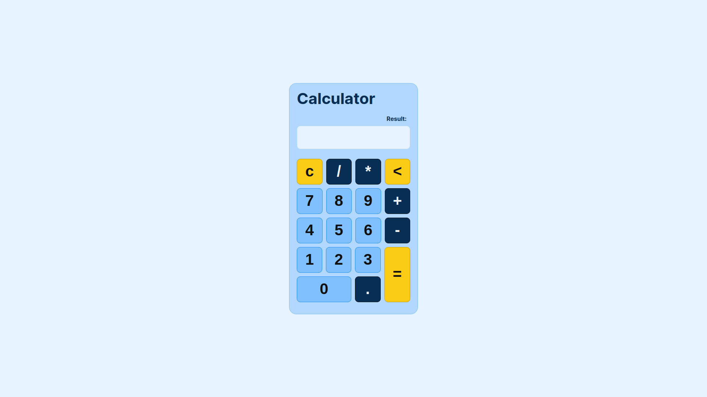

<h1 align="center">
Calculator App With Angular 18, MVVM, Less Css, Eslint, Prettier, Jasmine Js, Karma Js, Express, Docker Compose, Typescript
</h1>

 

 

  <a href="#description">✍️ Description</a> &nbsp;&nbsp;&nbsp;|&nbsp;&nbsp;&nbsp <a href="#install">🔍 Install</a> &nbsp;&nbsp;&nbsp;|&nbsp;&nbsp;&nbsp <a href="#technologies">🚀 Technologies</a> &nbsp;&nbsp;&nbsp;|&nbsp;&nbsp;&nbsp <a href="#related">♟️ Related</a> &nbsp;&nbsp;&nbsp;|&nbsp;&nbsp;&nbsp <a href="#contact">✉️ Contact</a>

 
 

<h3 id="description">✍️ Description:</h3>

I end-up curious of how could I implement the calculator app with others web front-end library when first created the web calculator app with Next Js, and Nginx as a load balancer; that was a interesting thing to do. Because of all different ways of developing ui, Angular Js was one of my favorites by the styles it merges decorator and states, without having to embrace a whole different shape of architecture, and to be honest: MVVM made me remember the Android development - the platform which is what I spend most of my time and concern programming on.

 

<h3 id="install">🔍  Install:</h3>

To start the service, run the following commands:

**To run the service:**

`./service_starting.sh`

 

<h3 id="technologies">🚀 Technologies:</h3>

To build this project is used:

- Angular 18
- MVVM (Model-View-View-Model)
- Less Css
- Eslint
- Prettier
- EditorConfig
- Jasmine Js
- Karma Js
- Express
- Docker
- Docker Compose
- Typescript

 

<h3 id="related">♟️ Related:</h3>

See more:

<ul>
  <li><a href="https://github.com/samueldecarvalhodeveloper/Calculator-App-With-Jetpack-Compose-Kotlin-Material-3-JUnit-Mockk-Dagger-2-Coroutines-Ui-Automator">Calculator App With Jetpack Compose</a></li>
  <li><a href="https://github.com/samueldecarvalhodeveloper/Calculator-App-With-React-Native-Expo-Custom-Hooks-Typescript-Async-Storage-Prettier-Eslint">Calculator App With React Native</a></li>
  <li><a href="https://github.com/samueldecarvalhodeveloper/Pokedex-API-With-Elixir-PHP-Python-Laravel-Phoenix-FastAPI-Uvicorn-Asyncio-Unittest-PHP-Unit-Docker">Pokedex Api With Laravel</a></li>
</ul>

 

<h3 id="contact">✉️  Contact:</h3>

**Email:**
<a href="mailto:personal.samuelcarvalho@gmail.com">personal.samuelcarvalho@gmail.com</a>

 
 

<strong>Repository Link:</strong>

[https://github.com/samueldecarvalhodeveloper/Calculator-App-With-Vue-Js-Nuxt-Js-3-Bun-Js-Docker-Compose-Pinia-Typescript-Cypress-Eslint-Prettier](https://github.com/samueldecarvalhodeveloper/Calculator-App-With-Vue-Js-Nuxt-Js-3-Bun-Js-Docker-Compose-Pinia-Typescript-Cypress-Eslint-Prettier)
